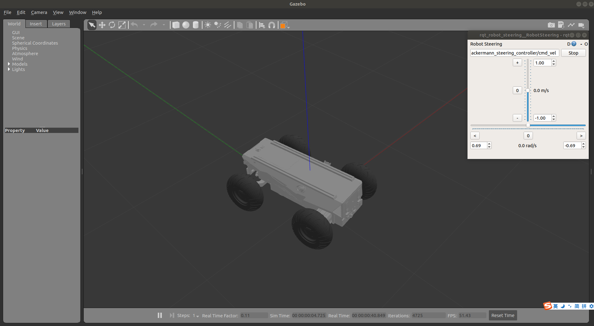

# hunter2.0仿真操作流程

[TOC]

## 一、功能包介绍

```
├── hunter2_base
├── hunter2_control
├── hunter2_gazebo
├── image
├── steer_bot_hardware_gazebo
└── steer_drive_controller
```

​	hunter2_base: 该文件夹为模型文件功能包

​	hunter2_control: 该文件为仿真控制器功能包

​	hunter2_gazebo: 该文件为Gazebo仿真功能包

​	steer_bot_hardware_gazebo: 阿克曼转向机构机器人Gazebo仿真插件

​	steer_drive_controller:  阿克曼转向机构机器人控制器

​	（[steer_bot_hardware_gazebo](http://wiki.ros.org/steer_bot_hardware_gazebo?distro=indigo)和[steer_drive_controller](http://wiki.ros.org/steer_drive_controller?distro=indigo)均为官网提供) 

## 二、环境

#### 开发环境：

​	ubuntu 18.04 + [ROS Melodic desktop full](http://wiki.ros.org/melodic/Installation/Ubuntu)

#### 下载安装必备功能包：

​	下载安装ros-control功能包，ros-control是ROS提供的机器人控制中间件

```
sudo apt-get install ros-melodic-ros-control
```

​	下载安装ros-controllers功能包，ros-controllers是ROS提供的常见车型运动学插件

```
sudo apt-get install ros-melodic-ros-controllers
```

​	下载安装gazebo-ros功能包，gazebo-ros是gazebo和ROS之间的通信接口，将ROS和Gazebo连接起来

```
sudo apt-get install ros-melodic-gazebo-ros
```

​	下载安装gazebo-ros-control功能包， gazebo-ros-control是在ROS和Gazebo之间通信的标准控制器

```
sudo apt-get install ros-melodic-gazebo-ros-control
```

​	下载安装rqt-robot-steering插件，rqt_robot_steering是与机器人运动控制的密切相关的ROS工具，它可以发布机器人直线运动和转向运动的控制指令，通过滑动条可以十分方便地控制机器人运动

```
sudo apt-get install ros-melodic-rqt-robot-steering 
```


## 三、用法

### 	1、创建工作空间、下载仿真模型功能包并编译

​		打开一个新终端，创建一个工作空间，名字为hunter_ws，在终端中输入：

```
mkdir hunter_ws
```

​		进入到hunter_ws文件夹中

```
cd hunter_ws
```

​		创建一个用于存放功能包的文件夹，名字为src

```
mkdir src
```

​		进入到src文件夹

```
cd src
```

​		初始化文件夹

```
catkin_init_workspace
```

​		下载仿真模型功能包

```
git clone https://github.com/agilexrobotics/ugv_sim/hunter.git
```

​		进入hunter_ws文件夹

```
cd hunter_ws
```

​		确认功能包的依赖有没有安装好

```
rosdep install --from-paths src --ignore-src -r -y 
```

​		进行编译

```
catkin_make
```

### 	2、运行hunter2.0的模型启动文件，在Rviz中可视化urdf文件

​		进入到hunter_ws文件夹

```
cd hunter_ws
```

​		声明环境变量

```
source devel/setup.bash
```

​		运行hunter2.0的启动文件，在Rviz中可视化模型

```
roslaunch hunter2_base display_xacro.launch
```


### 	3、启动hunter2.0的gazebo仿真环境，并在gazebo中控制hunter2.0运动

​		进入到hunter_ws文件夹

```
cd hunter_ws
```

​		声明环境变量

```
source devel/setup.bash
```

​		启动hunter2.0仿真环境，滑动Robot Steering 小插件的滑动条控制机器人运动

```
roslaunch hunter2_gazebo hunter2_gazebo.launch
```




