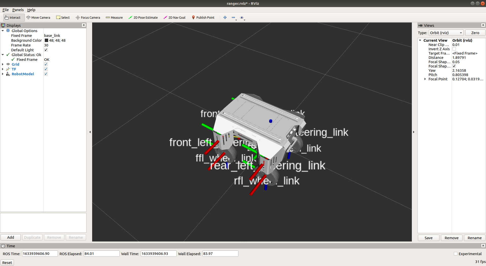

[TOC]

# ranger_mini仿真操作流程

## 一、功能包介绍

'''
├── four_wheel_steering_controller
├── four_wheel_steering_msgs
├── ranger_mini
├── ranger_mini_control
├── ranger_mini_gazebo
└── urdf_geometry_parser
'''

​	ranger_mini: 该文件夹为模型文件功能包

​	ranger_mini_control: 该文件夹为仿真控制器功能包

​	ranger_mini_gazebo: 该文件夹为gazebo仿真功能包

​	four_wheel_steering_controller: 该文件夹为四轮四转控制器功能包

​	four_wheel_steering_msgs: 该文件夹为四轮四转消息功能包

​	urdf_geometry_parser :该文件夹为urdf解析器

​	[four_wheel_steering](http://wiki.ros.org/four_wheel_steering_controller)、[four_wheel_steering_msgs](http://wiki.ros.org/four_wheel_steering_msgs)、[urdf_geometry_parser](http://wiki.ros.org/urdf_geometry_parser)均为官网提供

## 二、环境

### 开发环境

​	ubuntu 18.04 + [ROS Melodic desktop full](http://wiki.ros.org/melodic/Installation/Ubuntu)

### 下载安装必备功能包

​	下载安装ros-control功能包，ros-control是ROS提供的机器人控制中间件

```
sudo apt-get install ros-melodic-ros-control
```

​	下载安装ros-controllers功能包，ros-controllers是ROS提供的常见车型运动学插件

```
sudo apt-get install ros-melodic-ros-controllers
```

​	下载安装gazebo-ros功能包，gazebo-ros是gazebo和ROS之间的通信接口，将ROS和Gazebo连接起来

```
sudo apt-get install ros-melodic-gazebo-ros
```

​	下载安装gazebo-ros-control功能包， gazebo-ros-control是在ROS和Gazebo之间通信的标准控制器

```
sudo apt-get install ros-melodic-gazebo-ros-control
```

​	下载安装rqt-robot-steering插件，rqt_robot_steering是与机器人运动控制的密切相关的ROS工具，它可以发布机器人直线运动和转向运动的控制指令，通过滑动条可以十分方便地控制机器人运动

```
sudo apt-get install ros-melodic-rqt-robot-steering 
```


## 三、用法

### 	1、创建工作空间、下载仿真模型功能包并编译

​		打开一个新终端，创建一个工作空间，名字为ranger_mini_ws，在终端中输入：

```
mkdir ranger_mini_ws
```

​		进入到ranger_ws文件夹中

```
cd ranger_mini_ws
```

​		创建一个用于存放功能包的文件夹，名字为src

```
mkdir src
```

​		进入到src文件夹

```
cd src
```

​		初始化文件夹

```
catkin_init_workspace
```

​		下载仿真模型功能包

```
git clone https://github.com/agilexrobotics/ugv_sim/ranger.git
```

​		进入ranger_mini_ws文件夹

```
cd ranger_mini_ws
```

​		确认功能包的依赖有没有安装好

```
rosdep install --from-paths src --ignore-src -r -y 
```

​		进行编译

```
catkin_make
```


### 2、运行ranger_mini的模型启动文件，在Rviz中可视化urdf文件

​	进入到ranger_mini_ws文件夹

```
cd ranger_mini_ws
```

​	声明环境变量	

```
source devel/setup.bash
```

​	运行ranger_mini的启动文件，在Rviz中可视化模型

```
roslaunch ranger_mini display_xacro.launch 
```



### 3、启动ranger_mini_的gazebo仿真环境，并在gazebo中控制ranger_mini运动

​	进入到ranger_mini_ws

```
cd ranger_mini_ws
```

​	声明环境变量

```
source devel/setup.bash
```

启动ranger_mini 仿真环境，滑动Robot Steering 小插件的滑动条控制机器人运动

```
roslaunch ranger_mini_gazebo launch_simulation.launch
```

 


 

