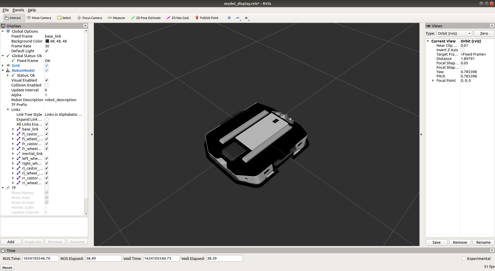

# tracer仿真操作流程

## 一、功能包介绍

 

tracer_description: 该文件为模型文件功能包

tracer_gazebo_sim: 该文件夹为gazebo仿功能包

## 二、环境

开发环境：ubuntu 18.04 + ROS Melodic desktop full。

假如你没有安装ROS，请按照官网的教程安装ROS。

ROS安装完成之后，按照下面的指令下载依赖：

```
sudo apt-get install ros-melodic-ros-control

sudo apt-get install ros-melodic-ros-controllers

sudo apt-get install ros-melodic-gazebo-ros

sudo apt-get install ros-melodic-gazebo-ros-control

sudo apt-get install ros-melodic-teleop-twist-keyboard	
```


## 三、用法

### 第一步、创建工作空间并下载功能包

打开一个新终端，创建一个新的工作空间，在终端中输入：

```
mkdir tracer_ws/src

cd tracer_ws/src

catkin_init_workspace

git clone 

cd ..

rosdep install --from-paths src --ignore-src -r -y  

catkin_make
```

### 第二步、运行tracer的启动文件，在Rviz中可视化urdf文件

```
cd tracer_ws

source devel/setup.bash

#启动tracer

roslaunch tracer_description display_models.launch 
```

 

### 第三步、运行tracer_gazebo_sim的启动文件，并在gazebo中控制tracer运行

```
cd tracer_ws

source devel/setup.bash

#启动tracer仿真环境
```

 

```
#键盘控制

rosrun teleop_twist_keyboard teleop_twist_keyboard.py 
```

 

启动键盘控制之后，可以通过“i”，“j”，“l”，“，”控制scout2.0和scout_mini，前进，向左，向右，后退
